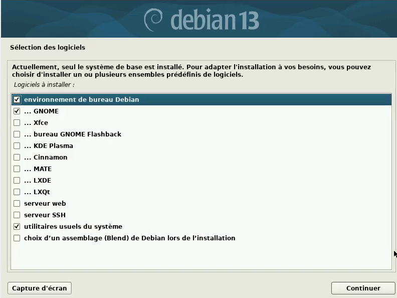
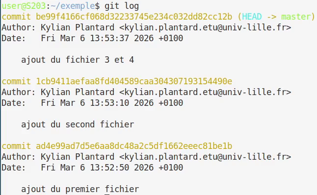
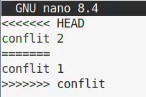

= SAÉ 2.03 : Rapport Technique Intermédiaire
Lefebvre Romain; Plantard Kylian; Belot Emilien
:date: 2026-03-XX
:toc: left
:toc-title: Table des matières
:sectnums:
:icons: font
:source-highlighter: rouge

[NOTE]
====
**Présentation** +
[.lead]
Ce rapport retrace l'installation, la configuration et l'automatisation d'une machine virtuelle sous #Debian 13#, ainsi que les réponses aux questions techniques associées.
====

== Préparation de la machine virtuelle

=== Création et caractéristiques de la VM

Nous avons mis en place une machine virtuelle dans VirtualBox en respectant les spécifications suivantes :

* **Nom de la machine** : `sae203`
* **Type de système** : Linux
* **Version** : Debian 64-bit
* **Mémoire vive (RAM)** : 2048 Mo
* **Disque dur** : 20 Go (une seule partition de la taille totale)

image::image/config.png[Configuration de la VM, pdfwidth=60%, width=60%]

=== Installation de l'OS de base

Lors de l'installation du système d'exploitation à partir de l'image ISO, nous avons appliqué les paramètres suivants :

. **Nom de la machine** : `serveur`
. **Miroir réseau** : `http://debian.polytech-lille.fr`
. **Comptes créés** : 
  ** Administrateur : `root`
  ** Utilisateur standard : `user`
. **Sélection des logiciels** : 
  ** Environnement de bureau Debian
  ** MATE
  ** Serveur web
  ** Serveur SSH
  ** Utilitaires usuels du système

=== Préparation du système et Suppléments invités

Afin de faciliter l'administration du système, nous avons accordé les droits `sudo` à l'utilisateur `user` via la console tty1 (`Ctrl + Alt + F1`) connecté en tant que root :

[source,bash]
----
usermod -aG sudo user
----
man usermod footnote:[https://manpages.debian.org/trixie/passwd/usermod.8.en.html[usermod Manpage]]

Nous avons ensuite inséré le CD virtuel des **Additions Invité** (Guest Additions) depuis le menu de VirtualBox, puis nous l'avons monté et installé en ligne de commande :

[source,bash]
----
sudo mount /dev/cdrom /mnt
sudo /mnt/VBoxLinuxAdditions.run
----
man mount footnote:[https://manpages.debian.org/trixie/mount/mount.8.en.html[mount Manpage]]

Un redémarrage a permis d'activer la redimension dynamique de la fenêtre.

== Réponses aux questions techniques (Semaine 07)

=== Configuration matérielle dans VirtualBox (Question 1)

[cols="1,2", options="header"]
|===
| Question | Réponse justifiée

| **Que signifie "64-bit" ?**
| Cela désigne l'architecture du processeur capable de traiter des données par blocs de 64 bits. Cela permet notamment de gérer plus de 4 Go de mémoire vive (RAM), contrairement au 32-bit.

| **Configuration réseau par défaut ?**
| Par défaut, VirtualBox utilise le mode **NAT** (Network Address Translation).

| **Pourquoi 2048 Mo de RAM ? Et avec 512 Mo ?**
| 2048 Mo permettent de faire tourner confortablement l'environnement graphique MATE. Avec seulement 512 Mo, le système utiliserait massivement la partition d'échange (Swap), rendant la machine extrêmement lente, et l'interface graphique pourrait même refuser de se lancer par manque de mémoire.

| **Mode réseau par défaut ?**
| Le mode NAT. Il isole la VM tout en lui donnant accès à Internet via la machine hôte.

| **Adresse IP de la VM ?**
|`ip address` footnote:[https://manpages.debian.org/trixie/iproute2/ip.8.en.html[IP manpage]] +
L'adresse IP est `10.0.2.15`.

| **Adresse de la passerelle ?**
|`ip route` +
La passerelle par défaut est `10.0.2.2`. Elle correspond au routeur virtuel créé par VirtualBox pour le mode NAT.
|===

=== Installation OS de base (Question 2)

[cols="1,2", options="header"]
|===
| Question | Réponse justifiée

| **Fichier iso bootable ?**
| C'est une image disque (une copie exacte d'un CD/DVD) contenant les fichiers nécessaires pour amorcer (booter) un ordinateur et installer un système d'exploitation.

| **https://wiki.debian.org/MATE[MATE] et https://wiki.debian.org/Gnome[GNOME] ?**
| Ce sont des Environnements de Bureau (Desktop Environments) pour Linux. Ils fournissent l'interface graphique (fenêtres, icônes, barres des tâches). GNOME est plus lourd et moderne, MATE est un dérivé plus léger.

| **Serveur mandataire (Proxy) ?**
| C'est un serveur qui agit comme intermédiaire entre les requêtes d'un client (notre VM) et un autre serveur (Internet). Il peut filtrer, mettre en cache ou sécuriser les connexions.

| **Serveur web ?**
| Un logiciel (comme Apache ou Nginx) qui répond aux requêtes HTTP/HTTPS pour distribuer des pages web à des clients (navigateurs).

| **Serveur SSH installé ?**
| Le paquet installé est `openssh-server`. On vérifie son état avec la commande `systemctl status ssh`.

| **Test de connexion SSH ?**
| Commande : `ssh user@10.0.2.15`. + 
**Problème rencontré** : La connexion échoue ("Timeout"). +
**Pourquoi ?** Parce que le mode réseau NAT de VirtualBox bloque les connexions entrantes depuis l'hôte vers la VM. Il faut configurer une redirection de ports (Port Forwarding) dans VirtualBox pour que cela fonctionne.
|===

=== Sudo et Suppléments invités (Questions 3 & 4)

* **Appartenance aux groupes** : Pour savoir à quels groupes appartient l'utilisateur `user`, on utilise la commande `groups user`   footnote:[https://manpages.debian.org/trixie/coreutils/groups.1.en.html[group manpage]]  ou `id user`  footnote:[https://manpages.debian.org/trixie/coreutils/groups.1.en.html[id manpage]].

* **Différence entre `su` et `sudo`** :
  ** `su`   footnote:[https://manpages.debian.org/trixie/util-linux/su.1.en.html[su manpage]] (substitute user) permet de changer d'utilisateur (souvent pour devenir `root`) et requiert le mot de passe de **l'utilisateur cible**.
  ** `sudo` footnote:[https://manpages.debian.org/trixie/sudo/sudo.8.en.html[sudo manpage]] (substitute user do) permet d'exécuter une seule commande avec les privilèges d'un autre utilisateur (généralement `root`), mais nécessite le mot de passe de **l'utilisateur courant**.
* **Version du noyau Linux** : `uname -r`  footnote:[https://manpages.debian.org/trixie/coreutils/uname.1.en.html[uname manpage]] : 6.12.73+deb13-amd64

* **Utilité des suppléments invités** : Ils optimisent la VM. Deux raisons de les installer :
  . Permettre le redimensionnement dynamique de la fenêtre (ajustement automatique de la résolution).
  . Activer le presse-papiers partagé entre la machine hôte et la VM.
* **Commande `mount`** : En général, elle sert à attacher un système de fichiers (disque, clé USB) à l'arborescence du système (point de montage). Dans notre cas, elle a servi à rendre accessible le contenu du lecteur CD-ROM virtuel pour y exécuter le script d'installation.

== À propos de la distribution Debian (Question 4.2)

Pour répondre à ces questions, nous avons consulté la https://www.debian.org/doc/[documentation officielle Debian].

. **Le Projet Debian et son nom** : C'est une association d'individus qui ont pour cause commune de créer un système d'exploitation libre. Le nom "Debian" a été imaginé par son créateur, Ian Murdock, en combinant le prénom de sa petite amie de l'époque (Debra) et le sien (Ian).
. **Durées de prise en charge** :
  * _Minimale (Standard)_ : Environ 3 ans (1 an après la sortie de la version stable suivante).
  * _LTS (Long Term Support)_ : 5 ans au total.
  * _ELTS (Extended LTS)_ : Jusqu'à 10 ans (géré par une organisation tierce, Freexian).
. **Mises à jour de sécurité** : L'équipe de sécurité Debian fournit un support pour la version stable pendant environ 1 an après la sortie d'une nouvelle version stable.
. **Versions activement maintenues** : Il y en a au minimum 3. Leurs noms génériques sont : **Stable**, **Testing** (en test), et **Unstable** (instable, surnommée _Sid_). On peut aussi compter _Oldstable_.
. **Origine des noms de code** : Tous les noms de code des versions Debian proviennent des personnages des films d'animation _Toy Story_ (ex: Bullseye, Bookworm, Trixie).
. **Architectures de Trixie (Debian 13)** : La liste exacte peut varier d'ici sa sortie officielle, mais Debian prend historiquement en charge 9 architectures officielles (amd64, arm64, armel, armhf, i386, mips64el, mipsel, ppc64el, s390x).
. **Premier nom de code** : `Buzz` (Debian 1.1), annoncé en juin 1996.
. **Dernier nom de code annoncé** : _(À l'heure actuelle, la version 14 est `Forky` et la version 15 sera `Mac`). Forky a été annoncé pour faire suite à Trixie._

== Installation préconfigurée (Question 5)

[WARNING]
====
**Attention** +
La modification de l'installation automatisée se fait exclusivement dans le fichier `preseed-fr.cfg`.
====

=== Ajustement de la pré-configuration

[cols="1,2", options="header"]
|===
| Question | Réponse

| **Différence `pkgsel/include` et `tasksel`**
| `d-i pkgsel/include` permet de spécifier une liste de **paquets individuels** précis à installer (ex: `git`, `curl`). +
 `tasksel tasksel/first` installe des **tâches entières** qui regroupent des centaines de paquets (ex: `mate-desktop` ou `web-server`).

| **Sécurité du preseed**
| Oui, le fichier preseed contient souvent des informations sensibles, comme le mot de passe `root` (en clair ou haché). En production, il faut protéger ce fichier en le stockant sur un serveur web interne sécurisé (HTTPS avec authentification), ou en restreignant drastiquement les droits de lecture du fichier physique.
|===

=== Notre configuration automatisée

Pour répondre aux consignes de l'installation automatisée, nous avons édité le fichier `preseed-fr.cfg`. Voici les modifications clés apportées :

**Installation de MATE :**

[source,plaintext]
----
d-i tasksel/first multiselect standard, mate-desktop
----

**Ajout des paquets supplémentaires :**

[source,plaintext]
----
d-i pkgsel/include string sudo git sqlite3 curl bash-completion fastfetch
----

**Ajout de l'utilisateur user dans root :**
Nous avons modifié 

[source,plaintext]
----
d-i passwd/user-default-groups string audio cdrom video
----

Pour rajouter sudo

[source,plaintext]
----
d-i passwd/user-default-groups string audio cdrom video sudo
----

_(Nous avons ensuite régénéré l'ISO et l'installation s'est déroulée de manière totalement transparente jusqu'au redémarrage)._

== Étude des applications clientes (Semaine 10)

=== Configuration globale de git

`git config --global`  footnote:[https://git-scm.com/docs/git-config[git config docs]]   permet de definir des varible pour l'ordinateur qui sont utiliser lors des commit

=== Concepts de base (Question 1)

[cols="1,2", options="header"]
|===
| Question | Réponse justifiée

| **Différence entre Git et les logiciels comme GitHub/GitLab/Forgejo ?**
| git est l'outil de controle de version, alors que GitHub/GitLab/Forgejo sont des forge permettant de collaborer et de stoker les depot git en ligne.

| **Qu'est-ce qu'un dépôt Git ? Où sont stockées les données d'un dépôt local ?**
| Un dépôt Git, souvent appelé « repo », est un emplacement de stockage pour les fichiers de votre projet, ainsi que pour l'ensemble de l'historique des modifications apportées à ces fichiers. Elle sont stocker dans le .git

| **Différence entre un commit, une branche et un tag ?**
| commit: c'est un paquet qui contient les difference de chaque fichier par rapport au commit precedent +
branche: liste de commit +
tag: etiquette coller sur un commit

| **Qu'est-ce qu'un dépôt distant (remote) ? Comment lister les remotes configurés ?**
| un depot accessible par le reseau via internet par exemple. +
`git remote`

| **Différence entre git pull et git fetch ?**
| `git fetch`: recupere du depot distant vers le depot local +
`git pull`: recupere du depot distant et bascule a la branche branche actuel
|===

=== Protocoles réseau pour git (Question 2)

[cols="1,2", options="header"]
|===
| Question | Réponse justifiée

| **Quels sont les protocoles supportés par Git pour accéder à un dépôt ?**
a|
- protocole local sans port +
- protocole git port 9418 +
- protocole http(s) (mode intelligent et idiot) port 80 ou 443 +
- protocole ssh footnote:[https://git-scm.com/book/en/v2/Git-on-the-Server-The-Protocols[Git book - The Protocols]]

| **Sur quels ports réseau fonctionnent ces protocoles ?**
| le protocole git fonctionne sur le port 9418, le http sur 80, le https sur 443 et ssh sur 22

| **Comment configurer l'authentification SSH pour Git ?**
| il faut générer une clé SSH sur l'ordinateur `ssh-keygen -t ed25519 -C "exemple@univ-lille.fr"` puis l'ajouter sur le compte de la forge.
|===

=== Manipulation pratique de git (Question 3)

[cols="1,2", options="header"]
|===
| Question | Réponse justifiée / Commandes

| **Créez un nouveau dépôt Git local. Quelle commande utilisez-vous ? Que se passe-t-il ?**
| `git init` créé un dossier .git dans le repertoire actuel

| **Ajoutez plusieurs fichiers, faites au moins 3 commits. Utilisez git log pour visualiser l'historique.**
a| 
[source,bash]
----
git add fichier1
git commit -m "commit 1"
git add fichier2
git commit -m "commit 2"
git add fichier3
git commit -m "commit 3"
git log
----

| **Créez une nouvelle branche, faites des modifications, puis fusionnez (merge) cette branche avec la principale. Expliquez.**
a| image::image/branche.png[Git branche, pdfwidth=100%, width=100%] 

| **Qu'est-ce qu'un conflit de fusion ? Provoquez-en un et montrez comment le résoudre.**
a| image::image/conflit_terminal.png[conflit terminal, pdfwidth=100%, width=100%]

quand 2 branche modifie dans 2 commit different le meme fichier

| **Utilisez git diff pour comparer deux commits. Expliquez la sortie.**
a| image::image/diff_terminal.png[diff terminal, pdfwidth=40%, width=40%]
les lignes avec un `-` sont des lignes supprimer et les ligne avec un `+` sont les lignes ajouter, le reste sont les lignes autour du code modifié
 

| **Qu'est-ce que le fichier .gitignore ? Créez-en un pour ignorer les fichiers Java (.class, .jar).**
a| les expressions de selection de fichiers ecrit dans le .gitignore ne sont pas pris en compte par git.
[source,plaintext]
----
*.class
*.jar
----
|===