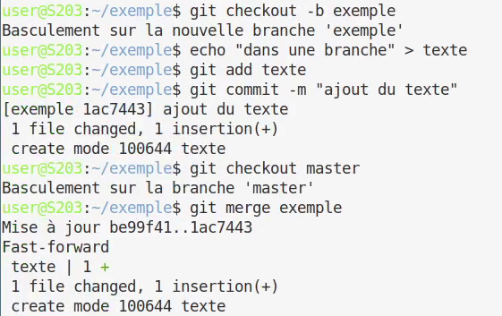
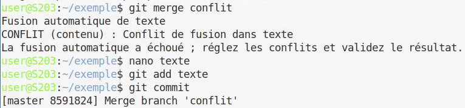

== Semaine 10 : Étude des applications clientes (Git)

_Auteurs : Lefebvre Romain, Plantard Kylian, Belot Emilien_

=== Configuration globale de Git

La commande `git config --global` footnote:[https://git-scm.com/docs/git-config[Documentation git config]] permet de définir des variables globales pour l'ordinateur, qui seront utilisées lors de vos commits (comme votre nom ou votre e-mail). +
Elles ne sont évidemment à faire qu'une fois par machine, et pas à chaque projet. Si l'email est différent que celui du compte, les commits ne seront pas associés au profil.

=== Concepts de base (Question 1)

[cols="1,2", options="header"]
|===
| Question | Réponse justifiée

| **Différence entre Git et les logiciels comme GitHub/GitLab/Forgejo ?**
| Git est l'outil de contrôle de version local en ligne de commande, alors que GitHub/GitLab/Forgejo sont des forges logicielles collaboratives (des plateformes web) permettant d'héberger et de gérer les dépôts Git en ligne footnote:[https://git-scm.com/book/fr/v2/Les-bases-de-Git-Travailler-avec-des-dépôts-distants[Documentation officielle Git - Dépôts distants]].

| **Qu'est-ce qu'un dépôt Git ? Où sont stockées les données d'un dépôt local ?**
| Un dépôt Git, souvent appelé "repo", est un emplacement de stockage pour les fichiers d'un projet et l'ensemble de l'historique de leurs modifications. Ces données sont stockées de façon masquée dans le dossier local `.git` footnote:[https://git-scm.com/book/fr/v2/D%c3%a9marrage-rapide-%c3%80-propos-de-la-gestion-de-version[Documentation Git - Le répertoire Git]].

| **Différence entre un commit, une branche et un tag ?**
| Un **commit** est un instantané contenant les différences de chaque fichier par rapport au commit précédent. +
Une **branche** est une ligne de développement indépendante (une suite de commits) footnote:[https://git-scm.com/book/fr/v2/Les-branches-avec-Git-Les-branches-en-bref[Documentation Git - Les Branches]]. +
Un **tag** est une étiquette figée collée sur un commit précis (souvent utilisée pour marquer les versions logicielles).

| **Qu'est-ce qu'un dépôt distant (remote) ? Comment lister les remotes configurés ?**
| Un dépôt distant est un dépôt accessible par le réseau (via Internet ou un réseau local d'entreprise). +
La commande `git remote -v` permet de lister ceux qui sont configurés sur le projet footnote:[https://git-scm.com/book/fr/v2/Les-bases-de-Git-Travailler-avec-des-dépôts-distants[Documentation Git - Commandes Remote]].

| **Différence entre git pull et git fetch ?**
| `git fetch` : récupère les données du dépôt distant vers le dépôt local (sans modifier vos fichiers de travail en cours). +
`git pull` : effectue un *fetch* puis fusionne directement ces nouvelles données avec la branche locale actuelle footnote:[https://git-scm.com/book/fr/v2/Les-bases-de-Git-Travailler-avec-des-dépôts-distants#_récupérer_et_tirer_depuis_vos_dépôts_distants[Documentation Git - Fetch vs Pull]].
|===

=== Protocoles réseau pour Git (Question 2)

[cols="1,2", options="header"]
|===
| Question | Réponse justifiée

| **Quels sont les protocoles supportés par Git pour accéder à un dépôt ?**
a|
* Protocole Local (accès au système de fichiers sans port)
* Protocole Git
* Protocole HTTP/HTTPS (mode intelligent et idiot) footnote:[Le mode intelligent est un serveur http qui comprend l'authentification et les push, tandis que le mode idiot est juste un serveur http basique qui distribue le dossier `.git`.]
* Protocole SSH footnote:[https://git-scm.com/book/fr/v2/Git-sur-le-serveur-Protocoles[Livre Git - Les Protocoles]]

| **Sur quels ports réseau fonctionnent ces protocoles ?**
| Le protocole Git fonctionne sur le port `9418`, HTTP sur le port `80`, HTTPS sur `443` et SSH sur le port `22` footnote:[https://git-scm.com/book/fr/v2/Git-sur-le-serveur-Les-protocoles[Documentation Git - Les protocoles réseau]].

| **Comment configurer l'authentification SSH pour Git ?**
| Il faut générer une paire de clés SSH sur l'ordinateur avec la commande `ssh-keygen -t ed25519 -C "exemple@univ-lille.fr"`, puis copier le contenu de la clé publique générée pour l'ajouter dans les paramètres de sécurité du compte sur la forge logicielle footnote:[https://git-scm.com/book/fr/v2/Git-sur-le-serveur-Génération-des-clés-publiques-SSH[Documentation Git - Génération clé SSH]].
|===

=== Manipulation pratique de Git (Question 3)

[cols="1,2", options="header"]
|===
| Question | Réponse justifiée / Commandes

| **Créez un nouveau dépôt Git local. Quelle commande utilisez-vous ? Que se passe-t-il ?**
| La commande `git init` crée un sous-dossier `.git` qui initialise la structure d'un dépôt vide dans le répertoire actuel footnote:[https://git-scm.com/docs/git-init[Documentation Git - git init]].

| **Ajoutez plusieurs fichiers, faites au moins 3 commits. Utilisez git log pour visualiser l'historique.**
a|
[source,bash]
----
touch fichier1 fichier2 fichier3 fichier4
git add fichier1
git commit -m "ajout du premier fichier"
git add fichier2
git commit -m "ajout du second fichier"
git add fichier3 fichier4
git commit -m "ajout du fichier 3 et 4"
git log
----
image::img/git-log-3commits.png[Résultat du git log, pdfwidth=100%, width=100%]
Le résultat est une liste des commits du plus récent au plus ancien avec leurs identifiants (be99f4166...), l'auteur, la date et le message de commit footnote:[https://git-scm.com/docs/git-log[Documentation Git - git log]].

| **Créez une nouvelle branche, faites des modifications, puis fusionnez (merge) cette branche avec la principale. Expliquez.**
a|

Une branche est une chaine de commits parallèle aux autres branches (ici `master` et `exemple`). +
La fusion (merge) permet de combiner les changements d'une branche dans une autre en rajoutant les commits de la branche source vers la branche cible footnote:[https://git-scm.com/docs/git-merge[Documentation Git - git merge]].

| **Qu'est-ce qu'un conflit de fusion ? Provoquez-en un et montrez comment le résoudre.**
a|

Un conflit survient lorsque deux branches modifient le même fichier de façon différente. +
Lors de la fusion, Git met le processus en pause et demande une résolution manuelle (choisir le code à garder et supprimer les marqueurs de conflit) footnote:[https://git-scm.com/book/fr/v2/Les-branches-avec-Git-Les-conflits-de-fusion[Documentation Git - Résolution de conflits]]. +
Pour résoudre le conflit, on modifie le fichier puis on le `git add` pour le marquer comme résolu, avant de faire un commit de fusion.
[source,plaintext]
----
<<<<<<< HEAD
conflit 1
=======
conflit 2
>>>>>>> conflit
----

| **Utilisez git diff pour comparer deux commits. Expliquez la sortie.**
a|
[source,diff]
----
diff --git a/texte b/texte
index 9d600a1..7255def 100644
--- a/texte
+++ b/texte
@@ -1 +1 @@
-dans une branche
+conflit 1
----
Les premières lignes indiquent les fichiers comparés (`a/texte` et `b/texte`) et les méta-données de la comparaison. (`index 9d600a1..7255def`) +
Les lignes précédées d'un `-` en rouge sont des suppressions et celles avec un `+` en vert sont des ajouts. +
Les autres lignes affichées servent de contexte autour du code modifié. +

| **Qu'est-ce que le fichier .gitignore ? Créez-en un pour ignorer les fichiers Java (.class, .jar).**
a|
C'est un fichier texte permettant de lister les motifs des fichiers/dossiers qui ne doivent pas être suivis et versionnés par Git footnote:[https://git-scm.com/docs/gitignore[Documentation Git - gitignore]].
[source,plaintext]
----
*.class
*.jar
----
|===

=== Travail collaboratif (Question 4)

[cols="1,2", options="header"]
|===
| Question | Réponse justifiée / Commandes

| **Création d'un dépôt privé partagé sur GitLab et clonage par chaque membre.**
| il faut faire `git clone git@gitlab-ssh.univ-lille.fr:notthedreamteam/exemple-sae203.git` footnote:[https://docs.gitlab.com/ee/user/project/repository/[Documentation GitLab - Clonage d'un dépôt]].

| **Chaque membre crée une branche, ajoute un fichier, et pousse (push) sa branche.**
a|
Voici la suite de commandes utilisées pour la branche de chaque membre footnote:[https://git-scm.com/book/fr/v2/Les-branches-avec-Git-Les-branches-en-bref[Documentation Git - Les branches]] :
[source,plaintext]
----
git switch --create emilien
echo "encore un fichier" > encore_un_fichier
git add encore_un_fichier
git commit -m "ajoute encore_un_fichier"
git push --set-upstream origin emilien
----

| **Fusion de toutes les branches dans la principale. Documentez les éventuels conflits.**
| On a fait des merge requests dans gitlab pour fusionner les branches footnote:[https://docs.gitlab.com/ee/user/project/merge_requests/[Documentation GitLab - Merge Requests]]. Nous avons pas eu de conflits car nous avons pas modifié les meme fichiers.

| **Qu'est-ce qu'une pull request (ou merge request) ? À quoi sert-elle ?**
| Une pull/merge request sert a demander la fusion d'une branche source vers une branche destination tout en permettant aux autres membres de vérifier le code avant validation footnote:[https://docs.gitlab.com/ee/user/project/merge_requests/[Documentation GitLab - Merge Requests]].

| **Testez la commande git blame. À quoi sert-elle ?**
| La commande `git blame fichier` permet d'afficher le fichier ligne par ligne en indiquant pour chaque ligne l'auteur, la date et le hash du commit qui l'a modifiée pour la dernière fois. C'est très utile pour retrouver l'origine d'un bout de code ou d'un bug footnote:[https://git-scm.com/docs/git-blame[Documentation officielle Git - git blame]].
|===

=== Les interfaces graphiques pour git (Question 5)

* **Qu'est-ce que le logiciel gitk ? Comment se lance-t-il ?** +
  C'est un visualiseur graphique pour les dépôts Git. Il permet d'explorer l'historique des commits, l'arborescence des branches, et de lire les diffs plus confortablement. Il se lance simplement en tapant la commande `gitk` dans le terminal depuis un dépôt Git footnote:[https://git-scm.com/docs/gitk[Documentation officielle Git - gitk]].
* **Qu'est-ce que le logiciel git-gui ? Comment se lance-t-il ?** +
  C'est une interface graphique pour la création de commits. Contrairement à gitk, il permet de sélectionner (stage) des fichiers, d'écrire le message de commit et de valider. Il se lance en tapant `git gui` dans le terminal footnote:[https://git-scm.com/docs/git-gui[Documentation officielle Git - git-gui]].

=== Installons autre chose et comparons (Questions 6 & 7)

**Choix de l'interface graphique (Question 6)**

image::img/interface.png[ungit, pdfwidth=60%, width=60%]

* **Pourquoi avez-vous choisi ce logiciel ?** +
  Nous avons choisi **Ungit** pour son approche extrêmement visuelle. Il représente l'historique de Git sous forme de nœuds interactifs et d'animations très intuitives. footnote:[https://github.com/FredrikNoren/ungit[Dépôt officiel GitHub de Ungit]].
* **Comment l'avez-vous installé ?** +
  Ungit est un paquet Node.js. Après avoir installé Node.js et `npm` sur le système, nous l'avons installé via la commande globale : `sudo -H npm install -g ungit`. Ensuite, il se lance en tapant `ungit` et s'ouvre directement sous forme d'onglet dans le navigateur web.
* **Comparaison avec les outils inclus dans Git et la ligne de commande pure :** +
  Par rapport à `gitk` ou `git-gui`, l'interface d'Ungit est bien plus moderne et unifie tout (historique, commit, push, merge) au même endroit de manière fluide. Par rapport à la ligne de commande pure, Ungit aide à mieux visualiser la topologie du projet, mais la ligne de commande reste plus rapide pour les opérations basiques et indispensable pour des commandes Git complexes.

**Analyse comparative approfondie (Question 7)**

[cols="1,1,1", options="header"]
|===
| Opération | En ligne de commande | Avec l'outil graphique choisi

| **Visualiser l'historique des commits**
| `git log` ou `git log --oneline --graph`
| Il suffit d'ouvrir la page web et de scroller pour voir l'arbre interactif des nœuds colorés.

| **Créer une nouvelle branche**
| `git branch <nom>` ou `git switch -c <nom>`
| Cliquer sur le nœud du commit actuel, taper le nom de la branche dans le champ de texte et cliquer sur le bouton "+ Branch".

| **Comparer deux versions d'un fichier (diff)**
| `git diff` ou `git diff <commit1> <commit2>`
a| image::img/diff.png[Git diff dans ungit, pdfwidth=100%, width=100%]

| **Résoudre un conflit de fusion**
| Ouvrir le fichier dans un éditeur (nano/vim), effacer les balises (<<<<<<<, =======), garder le bon code, puis faire `git add` et `git commit`.
| Ungit signale le conflit en rouge ("Resolve conflicts"). On peut ouvrir un outil de diff visuel ou marquer le fichier comme résolu directement depuis l'interface après modification.
|===

* **Quelles opérations sont plus rapides en ligne de commande ? Lesquelles sont plus claires avec l'interface graphique ?** +
  Les opérations courantes, basiques et répétitives (comme le `git add`, la création de branche, un `git commit` simple ou un `git push`) sont beaucoup plus rapides à taper en ligne de commande. En revanche, comprendre l'arborescence des branches, visualiser un historique complexe et repérer les modifications dans plusieurs fichiers en même temps est bien plus clair avec l'interface graphique.
* **Dans un contexte professionnel, quel outil privilégieriez-vous et pourquoi ?** +
  Dans un contexte professionnel, l'idéal est de combiner les deux. La ligne de commande est privilégiée pour la rapidité des actions quotidiennes et pour l'automatisation de scripts. L'interface graphique (Ungit, GitKraken, ou un outil intégré à l'IDE comme VS Code) est en revanche indispensable pour faire des revues de code, comprendre l'historique d'un projet avant une fusion (merge), et résoudre des conflits complexes avec moins de risque d'erreur.