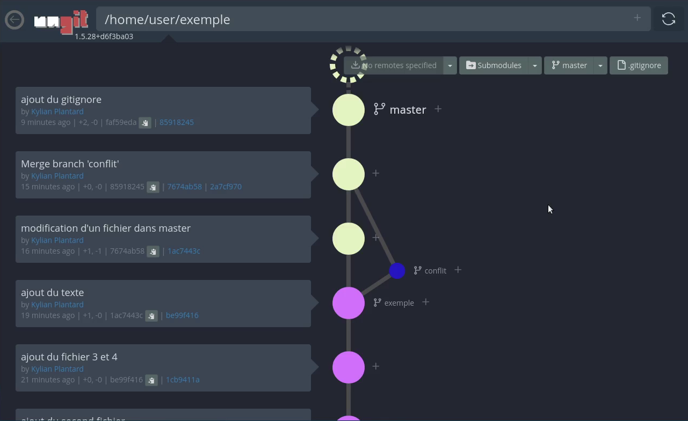

== Semaine 10 : Étude des applications clientes (Git)

_Auteurs : Lefebvre Romain, Plantard Kylian, Belot Emilien_

==== Configuration globale de Git

La commande `git config --global` footnote:[https://git-scm.com/docs/git-config[Documentation git config]] permet de définir des variables globales pour l'ordinateur, qui seront utilisées lors de vos commits (comme votre nom ou votre e-mail). +
Elles ne sont évidemment à faire qu'une fois par machine, et pas à chaque projet. Si l'email est différent que celui du compte, les commits ne seront pas associés au profil.

==== Concepts de base (Question 1)

[cols="1,2", options="header"]
|===
| Question | Réponse justifiée

| **Différence entre Git et les logiciels comme GitHub/GitLab/Forgejo ?**
| Git est l'outil de contrôle de version local en ligne de commande, alors que GitHub/GitLab/Forgejo sont des forges logicielles collaboratives (des plateformes web) permettant d'héberger et de gérer les dépôts Git en ligne.

| **Qu'est-ce qu'un dépôt Git ? Où sont stockées les données d'un dépôt local ?**
| Un dépôt Git, souvent appelé « repo », est un emplacement de stockage pour les fichiers d'un projet et l'ensemble de l'historique de leurs modifications. Ces données sont stockées de façon masquée dans le dossier local `.git`.

| **Différence entre un commit, une branche et un tag ?**
| Un **commit** est un instantané contenant les différences de chaque fichier par rapport au commit précédent. +
Une **branche** est une ligne de développement indépendante (une suite de commits). +
Un **tag** est une étiquette figée collée sur un commit précis (souvent utilisée pour marquer les versions logicielles).

| **Qu'est-ce qu'un dépôt distant (remote) ? Comment lister les remotes configurés ?**
| Un dépôt distant est un dépôt accessible par le réseau (via Internet ou un réseau local d'entreprise). +
La commande `git remote -v` permet de lister ceux qui sont configurés sur le projet.

| **Différence entre git pull et git fetch ?**
| `git fetch` : récupère les données du dépôt distant vers le dépôt local (sans modifier vos fichiers de travail en cours). +
`git pull` : effectue un *fetch* puis fusionne directement ces nouvelles données avec la branche locale actuelle.
|===

==== Protocoles réseau pour Git (Question 2)

[cols="1,2", options="header"]
|===
| Question | Réponse justifiée

| **Quels sont les protocoles supportés par Git pour accéder à un dépôt ?**
a|
* Protocole Local (accès au système de fichiers sans port)
* Protocole Git
* Protocole HTTP/HTTPS (mode intelligent et idiot) footnote:[Le mode intelligent est un serveur http qui comprend l'authentification et les push, tandis que le mode idiot est juste un serveur http basique qui distribue le dossier `.git`.]
* Protocole SSH footnote:[https://git-scm.com/book/en/v2/Git-on-the-Server-The-Protocols[Livre Git - Les Protocoles]]

| **Sur quels ports réseau fonctionnent ces protocoles ?**
| Le protocole Git fonctionne sur le port `9418`, HTTP sur le port `80`, HTTPS sur `443` et SSH sur le port `22`.

| **Comment configurer l'authentification SSH pour Git ?**
| Il faut générer une paire de clés SSH sur l'ordinateur avec la commande `ssh-keygen -t ed25519 -C "exemple@univ-lille.fr"`, puis copier le contenu de la clé publique générée pour l'ajouter dans les paramètres de sécurité du compte sur la forge logicielle.
|===

==== Manipulation pratique de Git (Question 3)

[cols="1,2", options="header"]
|===
| Question | Réponse justifiée / Commandes

| **Créez un nouveau dépôt Git local. Quelle commande utilisez-vous ? Que se passe-t-il ?**
| La commande `git init` crée un sous-dossier `.git` qui initialise la structure d'un dépôt vide dans le répertoire actuel.

| **Ajoutez plusieurs fichiers, faites au moins 3 commits. Utilisez git log pour visualiser l'historique.**
a|
[source,bash]
----
touch fichier1 fichier2 fichier3 fichier4
git add fichier1
git commit -m "ajout du premier fichier"
git add fichier2
git commit -m "ajout du second fichier"
git add fichier3 fichier4
git commit -m "ajout du fichier 3 et 4"
git log
----
image::img/git-log-3commits.png[Résultat du git log, pdfwidth=100%, width=100%]
Le résultat est une liste des commits du plus récent au plus ancien avec leurs identifiants (be99f4166...), l'auteur, la date et le message de commit.

| **Créez une nouvelle branche, faites des modifications, puis fusionnez (merge) cette branche avec la principale. Expliquez.**
a|
image::img/git-branch-merge.png[Git branche, pdfwidth=100%, width=100%]
Une branche est une chaine de commits parallèle aux autres branches (ici `master` et `exemple`). +
La fusion (merge) permet de combiner les changements d'une branche dans une autre en rajoutant les commits de la branche source vers la branche cible.

| **Qu'est-ce qu'un conflit de fusion ? Provoquez-en un et montrez comment le résoudre.**
a|
image::img/git-conflit-terminal.png[Conflit terminal, pdfwidth=100%, width=100%]
Un conflit survient lorsque deux branches modifient le même fichier de façon différente. +
Lors de la fusion, Git met le processus en pause et demande une résolution manuelle (choisir le code à garder et supprimer les marqueurs de conflit). +
Pour résoudre le conflit, on modifie le fichier puis on le `git add` pour le marquer comme résolu, avant de faire un commit de fusion.
[source,plaintext]
----
<<<<<<< HEAD
conflit 1
=======
conflit 2
>>>>>>> conflit
----

| **Utilisez git diff pour comparer deux commits. Expliquez la sortie.**
a|
[source,diff]
----
diff --git a/texte b/texte
index 9d600a1..7255def 100644
--- a/texte
+++ b/texte
@@ -1 +1 @@
-dans une branche
+conflit 1
----
Les premières lignes indiquent les fichiers comparés (`a/texte` et `b/texte`) et les méta-données de la comparaison. (`index 9d600a1..7255def`) +
Les lignes précédées d'un `-` en rouge sont des suppressions et celles avec un `+` en vert sont des ajouts. +
Les autres lignes affichées servent de contexte autour du code modifié. +

| **Qu'est-ce que le fichier .gitignore ? Créez-en un pour ignorer les fichiers Java (.class, .jar).**
a|
C'est un fichier texte permettant de lister les motifs des fichiers/dossiers qui ne doivent pas être suivis et versionnés par Git.
[source,plaintext]
----
*.class
*.jar
----
|===

==== Travail collaboratif (Question 4)

[cols="1,2", options="header"]
|===
| Question | Réponse justifiée / Commandes

| **Création d'un dépôt privé partagé sur GitLab et clonage par chaque membre.**
| 

| **Chaque membre crée une branche, ajoute un fichier, et pousse (push) sa branche.**
| 

| **Fusion de toutes les branches dans la principale. Documentez les éventuels conflits.**
| 

| **Qu'est-ce qu'une pull request (ou merge request) ? À quoi sert-elle ?**
| 

| **Testez la commande git blame. À quoi sert-elle ?**
| 
|===

==== Les interfaces graphiques pour git (Question 5)

* **Qu'est-ce que le logiciel gitk ? Comment se lance-t-il ?** +
  _[Espace pour répondre]_
* **Qu'est-ce que le logiciel git-gui ? Comment se lance-t-il ?** +
  _[Espace pour répondre]_

==== Installons autre chose et comparons (Questions 6 & 7)

**Choix de l'interface graphique (Question 6)**

* **Pourquoi avez-vous choisi ce logiciel ?** +
  _[Espace pour répondre]_
* **Comment l'avez-vous installé ?** +
  _[Espace pour répondre]_
* **Comparaison avec les outils inclus dans Git et la ligne de commande pure :** +
  _[Espace pour répondre : fonctionnalités, avantages, inconvénients]_

**Analyse comparative approfondie (Question 7)**

[cols="1,1,1", options="header"]
|===
| Opération | En ligne de commande | Avec l'outil graphique choisi

| **Visualiser l'historique des commits**
| 
| 

| **Créer une nouvelle branche**
| 
| 

| **Comparer deux versions d'un fichier (diff)**
| 
a| image::image/diff.png[Git diff dans ungit, pdfwidth=100%, width=100%]

| **Résoudre un conflit de fusion**
| 
| 
|===

* **Quelles opérations sont plus rapides en ligne de commande ? Lesquelles sont plus claires avec l'interface graphique ?** +
  _[Espace pour répondre]_
* **Dans un contexte professionnel, quel outil privilégieriez-vous et pourquoi ?** +
  _[Espace pour répondre]_
