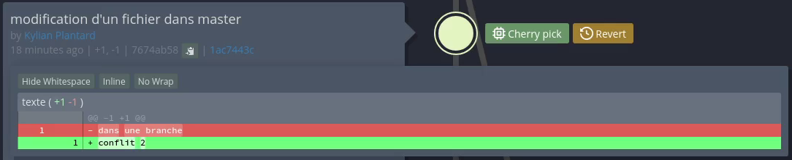

== Semaine 10 : Tutoriel - Utilisation de Git et travail collaboratif

_Auteurs : Lefebvre Romain, Plantard Kylian, Belot Emilien_

[NOTE]
====
**Présentation** +
Ce tutoriel explique notre prise en main de l'outil de versionnement Git, depuis la configuration locale jusqu'au travail collaboratif sur GitLab, en passant par l'utilisation d'interfaces graphiques.
====

=== 1. Configuration globale et initialisation

Avant de commencer à versionner notre code, nous avons dû configurer notre identité sur notre machine (à ne faire qu'une seule fois) pour que nos futurs commits nous soient bien attribués :
[source,bash]
----
git config --global user.name "Prénom Nom"
git config --global user.email "prenom.nom@etu.univ-lille.fr"
----

Ensuite, nous avons créé un dossier de travail et initialisé un nouveau dépôt Git local vierge à l'intérieur :
[source,bash]
----
mkdir projet-sae
cd projet-sae
git init
----

=== 2. Manipulations locales (Add, Commit, Log)

Nous avons créé plusieurs fichiers et enregistré notre progression à travers des "commits" (des instantanés de notre projet). 
[source,bash]
----
touch fichier1 fichier2 fichier3 fichier4
git add fichier1
git commit -m "ajout du premier fichier"
git add fichier2
git commit -m "ajout du second fichier"
git add fichier3 fichier4
git commit -m "ajout du fichier 3 et 4"
----

Pour vérifier que tout a bien été enregistré, nous avons utilisé la commande `git log` :
[source,bash]
----
git log
----
image::img/git-log-3commits.png[Résultat du git log, pdfwidth=100%, align="center"]

=== 3. Gestion des branches et fusions (Merge)

Pour développer une fonctionnalité sans casser le code principal, nous avons créé une branche parallèle nommée `exemple`. Nous avons fait des modifications dessus, puis nous l'avons fusionnée (merge) avec la branche principale (`master`) :
[source,bash]
----
git switch -c exemple
# ... modifications et commits ...
git switch master
git merge exemple
----
image::img/git-branch-merge.png[Git branche, pdfwidth=100%, align="center"]

=== 4. Résolution de conflits

Un conflit de fusion survient lorsque deux branches modifient la même ligne d'un même fichier. Nous en avons provoqué un volontairement. 
Lors du merge, Git s'est mis en pause. En ouvrant le fichier en conflit avec l'éditeur `nano`, nous avons vu les balises insérées par Git :
[source,plaintext]
----
<<<<<<< HEAD
conflit 1
=======
conflit 2
>>>>>>> conflit
----
image::img/git-conflit-terminal.png[Conflit terminal, pdfwidth=100%, align="center"]

Pour le résoudre, nous avons supprimé les balises (`<<<<<<<`, `=======`, `>>>>>>>`), gardé le code pertinent, puis validé la résolution :
[source,bash]
----
git add fichier_en_conflit
git commit -m "Résolution du conflit"
----

=== 5. Le fichier .gitignore

Pour éviter que Git ne suive des fichiers inutiles (comme des fichiers compilés Java), nous avons créé un fichier `.gitignore` à la racine de notre projet :
[source,plaintext]
----
*.class
*.jar
----

=== 6. Travail collaboratif sur GitLab

Pour travailler en équipe, nous avons utilisé un dépôt distant sur GitLab. 
Nous avons d'abord généré une clé SSH (`ssh-keygen -t ed25519`) que nous avons ajoutée à notre profil GitLab pour ne plus avoir à taper de mot de passe.

Nous avons cloné le projet :
[source,bash]
----
git clone git@gitlab-ssh.univ-lille.fr:notthedreamteam/exemple-sae203.git
----

Chaque membre a ensuite créé sa propre branche, ajouté un fichier, et poussé son travail sur le serveur :
[source,bash]
----
git switch --create emilien
echo "encore un fichier" > encore_un_fichier
git add encore_un_fichier
git commit -m "ajoute encore_un_fichier"
git push --set-upstream origin emilien
----
Enfin, sur l'interface web de GitLab, nous avons créé des "Merge Requests" pour fusionner le travail de chacun dans la branche principale.

=== 7. Utilisation d'une interface graphique (Ungit)

Bien que la ligne de commande soit rapide, nous avons testé une interface graphique web nommée **Ungit** (installée via `sudo npm install -g ungit`). 

image::img/interface.png[Interface Ungit, pdfwidth=60%, align="center"]

Ungit est extrêmement visuel. Il permet de voir l'arbre des commits sous forme de nœuds interactifs. Par exemple, pour comparer deux versions d'un fichier (l'équivalent de `git diff`), il suffit de cliquer sur le nœud correspondant :

L'interface graphique s'est révélée très pratique pour visualiser un historique complexe et comprendre la topologie des branches, tandis que la ligne de commande reste notre outil privilégié pour les opérations rapides du quotidien (add, commit, push).

=== 8. Retour d'expérience et difficultés rencontrées

* **Le fonctionnement des clés SSH :** Au début du travail collaboratif, nous avions des erreurs de permission (`Permission denied (publickey)`). Nous avons dû bien comprendre la différence entre clé privée (qui reste sur le PC) et clé publique (à donner à GitLab) pour résoudre le problème.
* **La panique du conflit de fusion :** Lors de notre premier conflit, voir le fichier rempli de chevrons `<<<<<<<` a été perturbant. Nous avons d'abord cru avoir cassé le code. Comprendre qu'il s'agissait simplement de texte à nettoyer manuellement dans un éditeur nous a beaucoup rassurés pour la suite du projet.