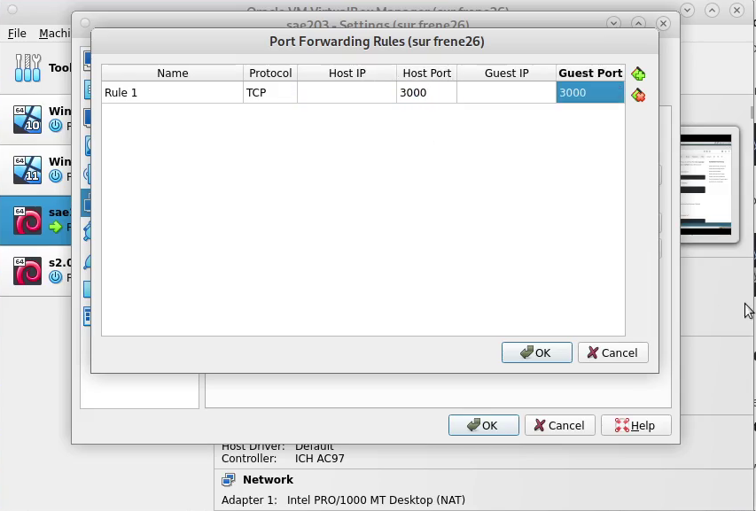
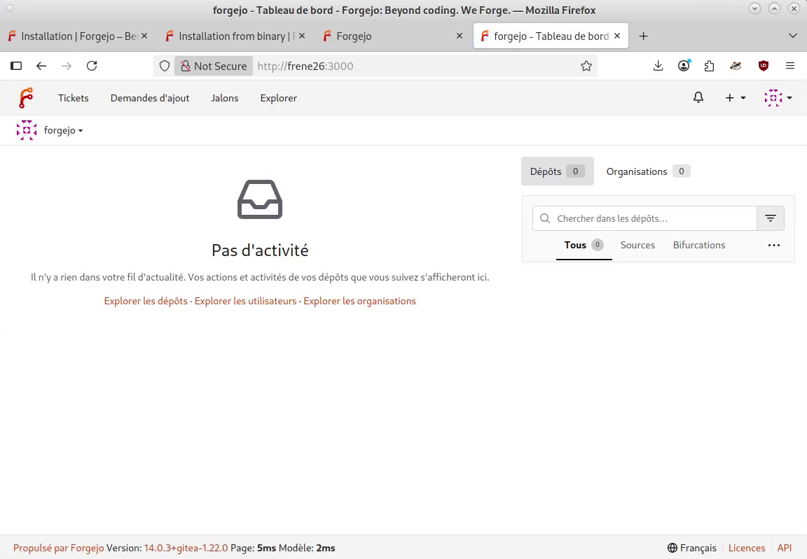
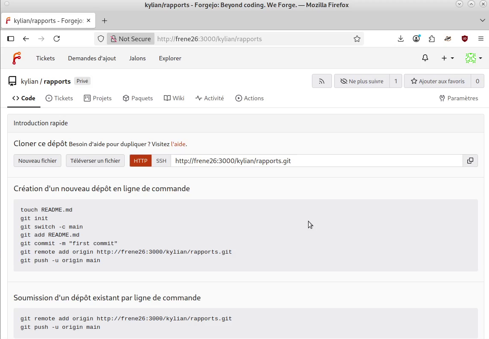

== Semaine 11 : Tutoriel - Installation et configuration de Forgejo

_Auteurs : Lefebvre Romain, Plantard Kylian, Belot Emilien_

[NOTE]
====
**Présentation** +
Ce tutoriel détaille la mise en place de Forgejo, une forge logicielle libre auto-hébergée, sur notre serveur Debian. Nous y abordons l'installation, la configuration du service, la sécurité, et nos tests pratiques d'utilisation en équipe.
====

=== 1. Préparation et Redirection de port

Avant d'installer Forgejo sur notre machine virtuelle, nous devions nous assurer de pouvoir y accéder depuis le navigateur web de notre machine hôte. Forgejo utilise par défaut le port `3000`. 
Nous avons donc configuré une nouvelle règle de redirection de port (NAT) dans VirtualBox pour rediriger le port hôte 3000 vers le port invité 3000.

=== 2. Installation de Forgejo et Base de données

Nous avons téléchargé le binaire précompilé officiel de Forgejo directement sur le serveur :
[source,bash]
----
wget -O forgejo https://codeberg.org/forgejo/forgejo/releases/download/v1.21.0/forgejo-1.21.0-linux-amd64
chmod +x forgejo
----

Pour la base de données, nous avons opté pour **SQLite**. Étant donné que notre VM ne possède que 2048 Mo de RAM, SQLite est parfait car il stocke les données dans un simple fichier local (`/var/lib/forgejo/data/forgejo.db`) et ne nécessite pas de faire tourner un lourd service de base de données (comme PostgreSQL ou MariaDB) en arrière-plan.

=== 3. Configuration du service Systemd

Pour que Forgejo s'exécute en arrière-plan, redémarre automatiquement en cas de crash, et se lance au démarrage du serveur, nous avons créé un service `systemd` (`/etc/systemd/system/forgejo.service`).

Nous avons ensuite activé et démarré le service avec ces commandes :
[source,bash]
----
sudo systemctl enable forgejo
sudo systemctl start forgejo
----
Pour vérifier que tout fonctionnait bien, nous avons consulté les logs en direct via :
`sudo journalctl -u forgejo -f`

=== 4. Sécurité de l'installation

Plusieurs mesures de sécurité ont été appliquées sur le serveur :

* **Droits d'accès :** Le service ne tourne pas en `root` (ce qui serait une énorme faille), mais avec un utilisateur standard dédié (`forgejo` ou `git`).
* **Permissions :** Le fichier de configuration `/etc/forgejo/app.ini` contient des mots de passe en clair (clés secrètes, configuration mail). Nous avons restreint ses droits (`chmod 640`) pour que seul l'utilisateur `forgejo` puisse le lire.
* **Port non privilégié :** Forgejo écoute sur le port 3000 car sous Linux, seuls les administrateurs peuvent écouter sur les ports inférieurs à 1024 (comme le port 80).

=== 5. Tests d'utilisation et Travail d'équipe

Une fois le service lancé, nous nous sommes connectés à l'interface web via `http://127.0.0.1:3000` (grâce à notre redirection de port).

Nous y avons effectué plusieurs manipulations collaboratives :
. **Création de comptes :** Création du compte administrateur initial, puis des comptes pour Romain, Kylian et Emilien.
. **Gestion des dépôts :** Nous avons testé la création de projets **publics** (visibles par tous) et de projets **privés** (invisibles sans y être invité).
. **Droits d'accès :** Ajout des membres de l'équipe sur un projet avec différents niveaux de permissions.
. **Liaison d'issues :** Nous avons testé la fermeture automatique d'un ticket (issue) en ajoutant le mot-clé `Fixes #3` dans le message d'un de nos commits poussé sur la forge.

=== 6. Intégration et Livraison Continues (CI/CD)

Pour aller plus loin, nous avons configuré les **Forgejo Actions**. L'objectif du CI/CD est d'automatiser des tâches à chaque `push`. Dans notre cas, nous avons créé un "Workflow" qui installe Asciidoctor et compile automatiquement notre rapport à chaque modification du code :

.Exemple de notre fichier `.forgejo/workflows/build.yml` :
[source,yaml]
----
name: Compilation AsciiDoc
on: [push]
jobs:
  build:
    runs-on: ubuntu-latest
    steps:
      - name: Récupération du code
        uses: actions/checkout@v3
      - name: Installation Asciidoctor
        run: sudo apt-get install -y asciidoctor
      - name: Compilation HTML
        run: asciidoctor rapport.adoc
----

=== 7. Retour d'expérience et difficultés rencontrées

* **Le piège du port SSH :** Le port SSH 22 de notre Debian étant déjà pris par le système principal, Forgejo utilise un serveur SSH interne (qui tourne souvent sur le port 2222). Nous avons eu du mal à faire notre premier `git push` car nous oubliions de préciser ce port réseau alternatif dans la commande de clonage de Git. Une fois l'URL corrigée (`ssh://git@localhost:2222/...`), l'authentification avec nos clés SSH a parfaitement fonctionné.
* **Erreurs de permissions sur le fichier de base de données :** Lors de nos premiers tests, Forgejo refusait de démarrer et affichait une erreur 500. En regardant les logs (avec `journalctl`), nous avons compris que l'utilisateur système `forgejo` n'avait pas les droits d'écriture sur le fichier SQLite `forgejo.db`. Un simple `chown` a résolu le problème.