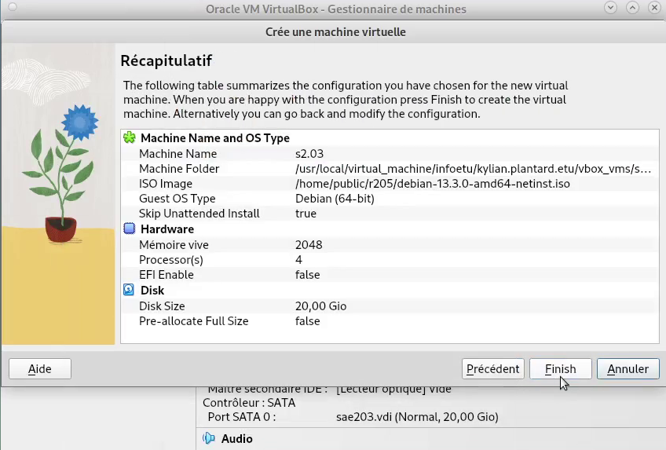
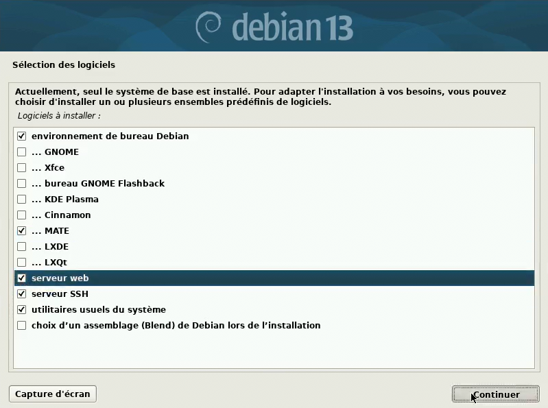

= SAÉ 2.03 : Rapport Technique Intermédiaire
Lefebvre Romain; Plantard Kylian; Belot Emilien
:date: 2026-03-06
:toc: left
:toc-title: Table des matières
:sectnums:
:experimental:
:icons: font
:source-highlighter: rouge

[NOTE]
====
**Présentation** +
[.lead]
Ce rapport retrace l'installation, la configuration et l'automatisation d'une machine virtuelle sous #Debian 13#, ainsi que les réponses aux questions techniques associées.
====

== Préparation de la machine virtuelle

=== Création et caractéristiques de la VM

Nous avons mis en place une machine virtuelle dans VirtualBox en respectant les spécifications suivantes :

* **Nom de la machine** : `s2.03`
* **Type de système** : Linux
* **Version** : Debian (64-bit)
* **Mémoire vive (RAM)** : 2048 Mo
* **Disque dur** : 20 Go (une seule partition de la taille totale)

=== Installation de l'OS de base

Lors de l'installation du système d'exploitation à partir de l'image ISO, nous avons appliqué les paramètres suivants :

. **Nom de la machine** : `serveur`
. **Miroir réseau** : `http://debian.polytech-lille.fr`
. **Comptes créés** :
  ** Administrateur : `root`
  ** Utilisateur standard : `user`
. **Sélection des logiciels** :
  ** Environnement de bureau Debian
  ** MATE
  ** Serveur web
  ** Serveur SSH
  ** Utilitaires usuels du système

=== Préparation du système et Suppléments invités

Afin de faciliter l'administration du système, nous avons accordé les droits `sudo` à l'utilisateur `user` via la console tty1 (kbd:[Ctrl+Alt+F1]) en étant connecté en tant que `root` :

[source,bash]
----
usermod -aG sudo user
----
man 8 usermod footnote:[https://manpages.debian.org/trixie/passwd/usermod.8.en.html[Page de manuel usermod]]

Nous avons ensuite inséré le CD virtuel des **Additions Invité** (Guest Additions) depuis le menu de VirtualBox, puis nous l'avons monté et installé en ligne de commande :

[source,bash]
----
sudo mount /dev/cdrom /mnt
sudo /mnt/VBoxLinuxAdditions.run
----
man 8 mount footnote:[https://manpages.debian.org/trixie/mount/mount.8.en.html[Page de manuel mount]]

Un redémarrage a permis d'activer le redimensionnement dynamique de la fenêtre.

== Réponses aux questions techniques (Semaine 07)

=== Configuration matérielle dans VirtualBox (Question 1)

[cols="1,2", options="header"]
|===
| Question | Réponse justifiée

| **Que signifie "64-bit" ?**
| Cela désigne l'architecture du processeur capable de traiter des données par blocs de 64 bits footnote:[https://fr.wikipedia.org/wiki/Processeur_64_bits[Wikipedia Processeur 64 bits]]. C'est l'architecture la plus courante pour les systèmes modernes.

| **Configuration réseau par défaut ?**
| Par défaut, VirtualBox émule un adaptateur réseau ethernet `Intel PRO/1000 MT Desktop` avec un cable virtuel connecté. +
`PCNet FAST III` est l'adaptateur par défaut pour les anciennes machines, mais les Debian utilisent le nouvel adaptateur footnote:[https://www.virtualbox.org/manual/ch06.html#nichardware[Manuel VirtualBox]]

| **Pourquoi 2048 Mo de RAM ? Et avec 512 Mo ?**
| 2048 Mo permettent de faire tourner confortablement l'installation ainsi que l'environnement graphique MATE. +
Avec seulement 512 Mo, le système utiliserait massivement la partition d'échange (Swap), rendant la machine extrêmement lente, et l'interface graphique pourrait même refuser de se lancer par manque de mémoire.

| **Mode réseau par défaut ?**
| Le mode NAT. Il isole la VM tout en lui donnant accès à Internet via la connexion de la machine hôte.

| **Adresse IP de la VM ?**
| `ip address` footnote:[https://manpages.debian.org/trixie/iproute2/ip.8.en.html[Page de manuel IP]] +
L'adresse IP est `10.0.2.15`.

| **Adresse de la passerelle ?**
| `ip route` +
La passerelle par défaut est `10.0.2.2`. Elle correspond au routeur virtuel créé par VirtualBox pour le mode NAT.
|===

=== Installation OS de base (Question 2)

[cols="1,2", options="header"]
|===
| Question | Réponse justifiée

| **Fichier iso bootable ?**
| C'est une image disque (une copie exacte d'un CD/DVD) contenant les fichiers nécessaires pour amorcer (booter) un ordinateur et installer un système d'exploitation.

| **https://wiki.debian.org/MATE[MATE] et https://wiki.debian.org/Gnome[GNOME] ?**
| Ce sont des Environnements de Bureau (Desktop Environments) pour Linux. Ils fournissent l'interface graphique (fenêtres, icônes, barres des tâches). GNOME est plus lourd et moderne, MATE est un dérivé plus léger.

| **Serveur mandataire (proxy) ?**
| C'est un serveur qui agit comme intermédiaire entre les requêtes d'un client (notre VM) et un autre serveur (Internet). Il peut filtrer, mettre en cache ou sécuriser les connexions.

| **Serveur web ?**
| Un logiciel (comme Apache ou Nginx) qui répond aux requêtes HTTP/HTTPS pour distribuer des pages web à des clients (navigateurs).

| **Serveur SSH installé ?**
| Le paquet installé est `openssh-server`. On vérifie son état avec la commande `systemctl status ssh`.

| **Test de connexion SSH ?**
| Commande : `ssh user@10.0.2.15`. +
**Problème rencontré** : La connexion échoue ("Timeout"). +
**Pourquoi ?** Parce que le mode réseau NAT de VirtualBox crée un réseau séparé de celui de l'hôte. Il faut configurer une redirection de ports (Port Forwarding) dans VirtualBox pour que cela fonctionne.
|===

=== Sudo et Suppléments invités (Questions 3 & 4)

* **Appartenance aux groupes** : Pour savoir à quels groupes appartient l'utilisateur `user`, on utilise la commande `groups user` footnote:[https://manpages.debian.org/trixie/coreutils/groups.1.en.html[Page de manuel groups]] ou `id user` footnote:[https://manpages.debian.org/trixie/coreutils/id.1.en.html[Page de manuel id]].
* **Différence entre `su` et `sudo`** :
  ** `su` footnote:[https://manpages.debian.org/trixie/util-linux/su.1.en.html[Page de manuel su]] (substitute user) permet de changer d'utilisateur (souvent pour devenir `root`) et requiert le mot de passe de #l'utilisateur cible#.
  ** `sudo` footnote:[https://manpages.debian.org/trixie/sudo/sudo.8.en.html[Page de manuel sudo]] (substitute user do) permet d'exécuter une seule commande avec les privilèges d'un autre utilisateur (généralement `root`), mais nécessite le mot de passe de #l'utilisateur courant#.
* **Version du noyau Linux** : `uname -r` footnote:[https://manpages.debian.org/trixie/coreutils/uname.1.en.html[Page de manuel uname]] : `6.12.73+deb13-amd64`
* **Utilité des suppléments invités** : Ils optimisent la VM. Deux raisons de les installer :
  ** Permettre le redimensionnement dynamique de la fenêtre (ajustement automatique de la résolution).
  ** Activer le presse-papiers partagé entre la machine hôte et la VM.
* **Commande `mount`** : En général, elle sert à attacher un système de fichiers (disque, clé USB) à l'arborescence du système (point de montage). Dans notre cas, elle a servi à rendre accessible le contenu du lecteur CD-ROM virtuel pour y exécuter le script d'installation.

== À propos de la distribution Debian (Question 4.2)

Pour répondre à ces questions, nous avons consulté la https://www.debian.org/doc/[documentation officielle de Debian].

. **Le Projet Debian et son nom** : C'est une association d'individus qui ont pour cause commune de créer un système d'exploitation libre. Le nom "Debian" a été imaginé par son créateur, Ian Murdock, en combinant le prénom de sa petite amie de l'époque (Debra) et le sien (Ian). +
https://www.debian.org/doc/manuals/project-history/intro.en.html[What is the Debian Project?]
. **Durées de prise en charge** :
  * _Minimale (Standard)_ : Environ 3 ans (1 an après la sortie de la version stable suivante).
  * _LTS (Long Term Support)_ : 5 ans au total. https://wiki.debian.org/LTS[Debian LTS]
  * _ELTS (Extended LTS)_ : Jusqu'à 10 ans (géré par une organisation tierce, Freexian). https://wiki.debian.org/LTS/Extended[Debian ELTS]
. **Mises à jour de sécurité** : L'équipe de sécurité Debian fournit un support pour la version stable pendant environ 1 an après la sortie d'une nouvelle version stable. https://www.debian.org/doc/manuals/debian-handbook/sect.release-lifecycle.en.html#id-1.4.9.16[Debian Release Lifecycle]
. **Versions activement maintenues** : Il y en a au minimum 3. Leurs noms génériques sont : _Stable_, _Testing_ (en test), et _Unstable_ (instable, surnommée _Sid_). On peut aussi compter _Oldstable_. https://www.debian.org/doc/manuals/debian-handbook/sect.release-lifecycle.en.html#id-1.4.9.16[Debian Release Lifecycle]
. **Origine des noms de code** : Tous les noms de code des versions Debian proviennent des personnages des films d'animation _Toy Story_ (ex. : Bullseye, Bookworm, Trixie). https://wiki.debian.org/ToyStory[Toy Story - Debian Wiki]
. **Architectures de Trixie (Debian 13)** : La version Trixie de Debian supporte: _amd64_, _aarch64_, _armhf_, _powerpc_, _riscv64_ et _system z_. https://www.debian.org/releases/trixie/index.html[Debian Trixie Release Information]
. **Premier nom de code** : `Buzz` (Debian 1.1), annoncé le 17 juin 1996. https://www.debian.org/doc/manuals/project-history/releases.en.html[Debian Releases]
. **Dernier nom de code annoncé** : La version 14 est `Forky` et la version 15 sera `Duke`. https://lists.debian.org/debian-devel-announce/2025/01/msg00004.html[Annonce de Forky - Debian Mailing List]

== Installation préconfigurée (Question 5)

[WARNING]
====
**Attention** +
La modification de l'installation automatisée se fait exclusivement dans le fichier `preseed-fr.cfg`.
====

=== Ajustement de la pré-configuration

[cols="1,2", options="header"]
|===
| Question | Réponse

| **Différence `pkgsel/include` et `tasksel`**
| `d-i pkgsel/include` permet de spécifier une liste de **paquets individuels** précis à installer (ex. : `git`, `curl`). +
`tasksel tasksel/first` installe des **tâches entières** qui regroupent des centaines de paquets (ex. : `mate-desktop` ou `web-server`).

| **Sécurité du preseed**
| Oui, le fichier preseed contient les mots de passe de `root` et de `user` en clair. En production, il faut protéger ce fichier en le stockant sur un serveur web interne sécurisé (HTTPS avec authentification), en restreignant drastiquement les droits de lecture du fichier physique ou en écrivant le hash uniquement.
|===

=== Notre configuration automatisée

Pour répondre aux consignes de l'installation automatisée, nous avons édité le fichier `preseed-fr.cfg`. Voici les modifications clés apportées :

**Installation de MATE :**
[source,plaintext]
----
d-i tasksel/first multiselect standard, mate-desktop
----

**Ajout des paquets supplémentaires :**
[source,plaintext]
----
d-i pkgsel/include string sudo git sqlite3 curl bash-completion fastfetch
----

**Ajout de l'utilisateur user dans root :**
Nous avons modifié le paramètre par défaut des groupe du nouvel utilisateur pour y rajouter `sudo` :
[source,diff]
----
-d-i passwd/user-default-groups string audio cdrom video
+d-i passwd/user-default-groups string audio cdrom video sudo
----

ajouter conclusion de la semaine 1